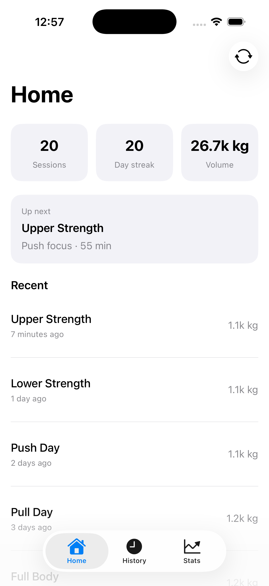
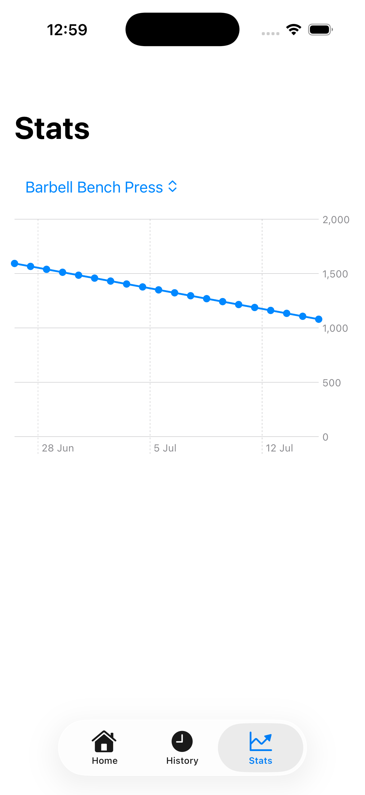
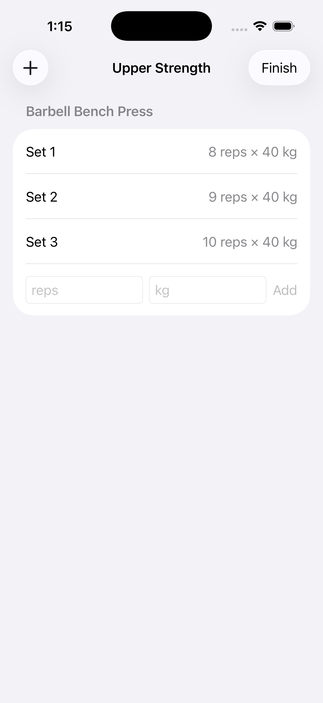
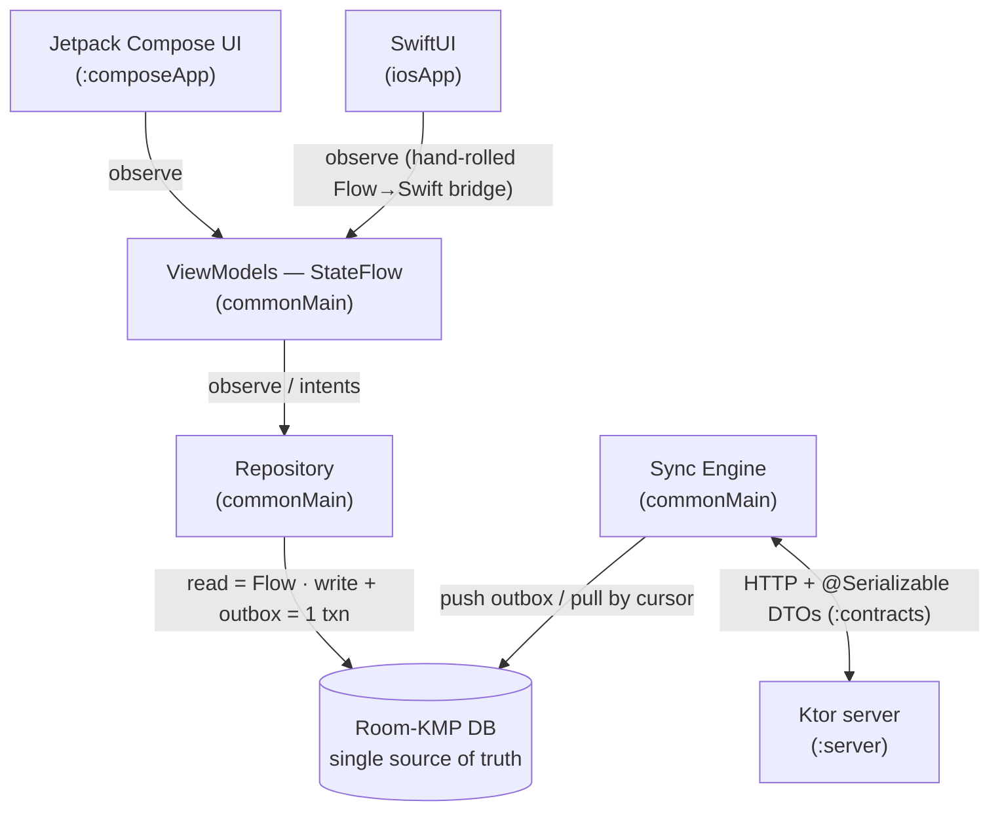

# MindSet

A cross-platform training log for hybrid/functional athletes (strength + conditioning + running).
**Offline-first**: the local database is the single source of truth, the UI only ever observes it,
and changes sync to a backend and pull back on another device. Built with Kotlin Multiplatform —
shared domain/data/sync/**ViewModels**, native UI (Jetpack Compose on Android, a thin SwiftUI shell
on iOS driven by the same shared ViewModels).

> Portfolio project. The interesting parts are the **KMP seam** (shared logic incl. ViewModels, native
> UI), the **offline-first sync engine**, and **measured performance** — see below. Every non-trivial
> decision has an [ADR](#architecture-decision-records) with the tradeoff and what I'd change at scale.

## Demo — iOS (SwiftUI over shared Kotlin ViewModels)

Every screen below is SwiftUI rendering state from a **shared** `commonMain` ViewModel — no
duplicated domain/data logic. The Android app (Jetpack Compose) is the primary UI and mirrors these.

| Home | Stats | Log Workout |
|---|---|---|
|  |  |  |

<sub>More: [History](docs/screenshots/ios-history.png) · [Session Detail](docs/screenshots/ios-session-detail.png) · [New Session](docs/screenshots/ios-new-session.png) · [Exercise Picker](docs/screenshots/ios-exercise-picker.png)</sub>

## Architecture



**The UI never reads the network.** It observes the DB via `Flow`; the network only feeds the DB
(pull) and drains the outbox (push).

- **`:shared`** (KMP) — domain, Room 3 database, repositories, sync engine, ViewModels
  (`commonMain`); platform seams (`androidMain`/`iosMain`) only for OS-governed capabilities
  (DB driver, HTTP engine, the Flow→Swift bridge).
- **`:composeApp`** — Android app (Jetpack Compose, navigation, Paging 3 exercise library).
- **`iosApp`** — thin SwiftUI shell consuming `:shared` (see [iOS interop](#the-kmp-seam-observing-a-kotlin-stateflow-from-swift)).
- **`:contracts`** — `@Serializable` sync DTOs shared by client **and** server.
- **`:server`** — minimal Ktor backend (in-memory) for sync.
- **`:benchmark`** — Macrobenchmark + Baseline Profile.

## Code sharing (measured)

`cloc`-style line counts (Kotlin/Swift, excluding generated/build output):

| Source set | LOC | What |
|---|---:|---|
| `:shared` / `commonMain` | 1623 | domain, data, Room schema, sync engine, **7 ViewModels** — shared verbatim |
| `:shared` / `androidMain` + `iosMain` | 213 | platform seams: DB driver, HTTP engine, Koin + Flow→Swift bridge |
| `:composeApp` (Compose UI) | 1458 | Android UI |
| `iosApp` (SwiftUI) | 675 | iOS UI |
| `:contracts` | 69 | DTOs shared client ↔ server |
| `:server` | 210 | Ktor sync backend |

**`:shared` is 88% platform-agnostic** (1623 / 1836) — only ~213 LOC of seams. **100% of the
domain/data/sync/presentation logic is written once**; each platform adds a thin native UI. The
SwiftUI app renders all 7 screens in **675 LOC** precisely because the ViewModels, state, and
intents already live in `commonMain`. Sharing *logic including ViewModels* — not UI — is the
deliberate line (see the [UI-sharing ADR](#adr-4-native-ui-per-platform--not-shared-ui)).

## Offline-first & sync

Local writes are instant and enqueue an **outbox** row in the **same Room transaction** (write +
intent-to-sync commit atomically — no lost updates if the process dies mid-write). The sync engine
drains the outbox (**push**) and pulls changes by a server-authoritative **cursor** (**pull**);
conflicts resolve **Last-Write-Wins** by `updatedAt`, applied symmetrically on server and client.
Every synced entity carries `id` (client UUID), `updatedAt`, `deleted` (soft delete), `syncStatus`.
Sessions sync as an **aggregate** — a session plus its logged exercises and sets travel as one
document, so a half-synced workout can never exist on another device.

## The KMP seam: observing a Kotlin `StateFlow` from Swift

Kotlin/Native exposes `suspend` functions to Swift, but **not `Flow`** in an observable form. Rather
than pull in SKIE or KMP-NativeCoroutines, I hand-rolled the bridge so the boundary stays explicit
and dependency-free ([`FlowObserver.kt`](shared/src/iosMain/kotlin/com/mindset/FlowObserver.kt)):

```kotlin
// shared/iosMain — collect on Main, push each value to Swift, return a cancel handle
fun subscribe(flow: Flow<*>, onEach: (Any?) -> Unit): FlowSubscription { … }
```

```swift
// iosApp — a SwiftUI ObservableObject wraps the shared ViewModel
subscription = FlowObserverKt.subscribe(flow: viewModel.rows) { [weak self] value in
    self?.rows = (value as? [HistoryRow]) ?? []   // generics erase at the ObjC boundary → cast once
}
```

Each screen is then a ~30-line Swift `Store` (resolve VM from Koin → subscribe → `@Published`) plus a
SwiftUI view. Notable seam gotchas hit and documented in code: Kotlin/Native mangles Obj-C `new*`
selectors (hence `doInitKoin`-style naming), and Paging 3 (`Flow<PagingData>`) has **no** Swift
consumer, so the iOS exercise picker reads the bounded catalog directly instead.

## Performance (Baseline Profile + Macrobenchmark)

Cold-start and scroll performance are **measured**, not asserted. `:benchmark` runs a Startup
Macrobenchmark (cold launch) and a Scroll Macrobenchmark (frame timing on the History list, seeded
to ~200 sessions), each under two compilation modes: `None` (no AOT — the "before") and
`Partial` + the generated **Baseline Profile** (the "after").

_Measured on a physical **Google Pixel 9 Pro**, 10 iterations per mode. `timeToInitialDisplay`
(TTID) is the time from launch to the first frame with content — Macrobenchmark reports it as
min/median/max (a trace metric, not sampled), so no percentiles here._

**Cold start** (`timeToInitialDisplay`, min/median/max):

| Metric | None (before) | Baseline Profile (after) | Change |
|---|---|---|---|
| TTID median | 249.3 ms | 202.4 ms | ↓ 18.8% |
| TTID max (worst case) | 264.2 ms | 214.7 ms | ↓ 18.7% |
| TTID min (best case) | 229.6 ms | 191.2 ms | ↓ 16.7% |

The Baseline Profile shifts the **entire distribution** down (~19% at the median), not just the
average — the win comes from AOT-compiling the hot startup path so it isn't JIT-compiled on the
critical path of the first launch.

**History scroll** (`FrameTimingMetric` over a fling on the seeded list):

| Metric | None (before) | Baseline Profile (after) |
|---|---|---|
| `frameOverrunMs` P90 | −8.9 ms | −9.4 ms |
| `frameOverrunMs` P99 | −6.0 ms | −6.6 ms |
| `frameDurationCpuMs` P90 | 5.7 ms | 5.6 ms |

**Reading this honestly:** `frameOverrunMs` is negative across every percentile in _both_ modes —
each frame finishes ~6–11 ms **ahead** of its deadline, so the fling never janks, with or without
the profile. Unlike startup, steady-state scrolling JIT-warms almost immediately, so AOT compilation
barely moves it. The measurable Baseline-Profile win is concentrated in **cold start**; the scroll
benchmark's value here is _confirming the absence of jank_ (a negative result worth stating), not
demonstrating a speedup. Profiling the cold-start trace likewise found no pathological main-thread
work — no synchronous DB open, no eager DI (all Koin singletons are lazy).

### The profiling-guided fix: Compose stability across the KMP seam

Profiling ruled out jank, so I turned the Compose compiler's own **stability report**
(`-PcomposeReports=true`) on the scroll path. It surfaced a latent issue:

```
// before
fun SessionRow( unstable session: Session, stable volumeKg: Double )
```

`Session` is an immutable `data class` (all `val`, primitives only), but it lives in `:shared`,
which has no Compose compiler — so the compiler can't infer its stability and defaults it to
**unstable**. `SessionRow` still skipped, but only via Strong Skipping's reference (`===`)
comparison; if the backing `Flow` ever re-emitted equal-but-new instances, every visible row would
recompose needlessly.

The fix is a **stability configuration file** ([`composeApp/compose_stability.conf`](composeApp/compose_stability.conf))
listing the immutable `:shared` model types — asserting their stability to the Compose compiler
_without_ adding a Compose dependency to `:shared` (which would violate the KMP seam). After:

```
// after
fun SessionRow( stable session: Session, stable volumeKg: Double )
```

`Session`, `SetEntry`, `LoggedItem`, `PlannedSession`, `HistoryRow`, `HomeStats` all flipped
unstable → **stable**, so those composables now skip on **value** equality. Honestly scoped: this
is a **robustness/correctness** fix (measured via the compiler report, not frame time — a Pixel 9
Pro has too much headroom to jank either way). The List/Map-holding UI states (`HomeUiState`,
`StatsUiState`, `LoggedItemUi`) remain unstable by design — the right fix there is
`kotlinx.collections.immutable`, tracked as a follow-up.

### Running the benchmarks (physical device, USB debugging)
```bash
# 1. Generate the Baseline Profile (packaged into the app APK).
./gradlew :composeApp:generateBaselineProfile

# 2. Startup: StartupBenchmark runs None vs Baseline Profile (before/after) — cold start.
./gradlew :benchmark:connectedBenchmarkReleaseAndroidTest \
  -Pandroid.testInstrumentationRunnerArguments.class=com.mindset.benchmark.StartupBenchmark

# 3. Scroll frame timing on the seeded History list.
./gradlew :benchmark:connectedBenchmarkReleaseAndroidTest \
  -Pandroid.testInstrumentationRunnerArguments.class=com.mindset.benchmark.ScrollBenchmark
```
Results print per-metric (min/median/max for startup; P50/P90/P95/P99 for frame timing) and are
written under `benchmark/build/outputs/`.

## Architecture Decision Records

Short, honest writeups — the decision, why, the tradeoff, and what I'd revisit at scale.

### ADR 1: Room-KMP (Room 3) over SQLDelight
Room 3 runs on Kotlin Multiplatform, so one DAO/entity layer serves both platforms. Chose it over
SQLDelight for the first-party migration path, the `Flow`-returning query API that fits the
observe-the-DB architecture, and familiarity. **Tradeoff:** SQLDelight's compile-time-checked SQL and
lighter iOS story are attractive; Room's KMP support is newer. **At scale:** revisit if complex
analytical SQL or non-Apple/Android targets appear.

### ADR 2: Custom Ktor backend over Supabase/Firebase
The sync backend is a minimal Ktor server (`:server`). Chose it over a BaaS to own the sync protocol
end-to-end and for the full-stack-Kotlin signal (`:contracts` DTOs shared client↔server). **Tradeoff:**
more ops and no free auth/storage vs. a BaaS. **At scale:** a managed Postgres + a real auth provider
behind the same DTO contract; the client wouldn't change.

### ADR 3: Last-Write-Wins over CRDTs
Conflicts resolve LWW by `updatedAt`, symmetric on client and server. Chose it because a training log
is single-user, low-contention — the simplest rule that's correct for the domain. **Tradeoff:** LWW can
drop a concurrent edit; CRDTs never lose data but add real complexity. **At scale / multi-editor:**
per-field merge or a CRDT for shared plans, kept behind the existing outbox/cursor seam.

### ADR 4: Native UI per platform — not shared UI
Shared everything *except* the UI: `commonMain` holds domain, data, sync, and **ViewModels**; each
platform writes its own Compose/SwiftUI. **Why:** platform-native feel, and the ViewModels already hold
all state + logic, so the UI layer is thin (SwiftUI = 675 LOC). **Tradeoff:** two UI layers to
maintain vs. Compose Multiplatform sharing them. **At scale:** CMP is viable, but I wanted to *measure*
how far shared-logic/native-UI goes — the [code-sharing numbers](#code-sharing-measured) are the answer.

### ADR 5: Hand-rolled `Flow`→Swift bridge over SKIE
A ~20-line `subscribe(flow, onEach)` helper instead of the SKIE compiler plugin. **Why:** zero new
dependencies and the KMP boundary stays legible (I can explain exactly how collection, main-thread
dispatch, and cancellation cross to Swift). **Tradeoff:** SKIE gives idiomatic `AsyncSequence` + sealed
classes for free. **At scale / bigger surface:** adopt SKIE — the per-screen glue would otherwise grow.

### ADR 6: Koin over Hilt/Metro
Koin is KMP-native (Hilt is Android-only). Kept swappable via **constructor injection** everywhere, so
the DI framework is a thin composition-root detail, not woven through the code.

## Build & run
- `./gradlew :composeApp:assembleDebug` — Android app
- `./gradlew :shared:testAndroidHostTest` / `:shared:iosSimulatorArm64Test` — shared tests
- `./gradlew :server:run` — sync backend on `:8080`
- iOS: open `iosApp/iosApp.xcodeproj` in Xcode and run (the shared framework builds via a
  `Compile Kotlin Framework` phase — no CocoaPods).
- See `AGENTS.md` for the full command list and architecture rules.

## Status & known limitations
Phases 0–4 complete: offline-first core (logging, exercise library, history, trends), sync engine
(outbox/cursor/LWW, multi-device), performance instrumentation (Baseline Profile + Macrobenchmark),
and the iOS app rendering the full screen set from shared ViewModels.

Known limitations / next steps (signals I know what's *not* done):
- **iOS is single-window and read-mostly-verified** — the interactive create/log flow is wired and
  compiles, but wasn't automated-tap-tested; no iPad/size-class adaptation yet.
- **Sync auth** is stubbed — the server is in-memory and unauthenticated (fine for the demo, not prod).
- **LWW** can drop a concurrent edit (see ADR 3); **List/Map UI states** aren't Compose-stable yet
  (needs `kotlinx.collections.immutable`).
- **No Health Connect / HealthKit** integration yet — the highest-value next feature and the best
  additional "shared vs native" seam.
- A dev-only iOS data seed (`seedDemoData`) is still wired in `iOSApp.init()`.
