# MIND[SET]

**An offline-first training tracker for fitness racing — Kotlin Multiplatform, native UI on both platforms.**

<p>


</p>

MIND[SET] is a training log for **fitness racing** — events where you run, hit a station, run again,
and where your split on each station decides your day. HYROX is the format shipped today; the data
layer treats a race format as *reference data*, so a new event is seed rows rather than a new app.

It works **entirely offline**. The local database is the single source of truth, the UI only ever
observes it, and the network — when enabled — feeds the database rather than the screen. No account,
no sign-in, no analytics in the shipped build.

> **Why this repo is interesting.** It is a production-shipped app (v1.0, Play-signed, R8-shrunk)
> built to be *defensible*: a 25-module KMP graph where 96% of the logic layer is platform-agnostic,
> a hand-written offline-first sync engine (outbox push · cursor pull · LWW · tombstones), a
> foreground-service race clock that survives process death, and **measured** startup performance
> with the negative results reported as honestly as the wins. Every non-trivial choice has an
> [ADR](#architecture-decision-records) stating the tradeoff and what I would revisit at scale.

---

## Table of contents

- [Product](#product) · [Screens](#screens) · [Campaign assets](#campaign-assets) · [Demo clip](#demo-clip)
- [Tech stack](#tech-stack)
- [Architecture](#architecture) — [module graph](#module-graph) · [dependency rule](#the-dependency-rule) · [data flow](#unidirectional-data-flow)
- [Data model](#data-model) — [race formats as data](#race-formats-are-data-not-code)
- [Offline-first & the sync engine](#offline-first--the-sync-engine)
- [The KMP seam](#the-kmp-seam) — [code sharing, measured](#code-sharing-measured) · [Flow → Swift](#observing-a-kotlin-stateflow-from-swift)
- [Performance](#performance)
- [Build & release engineering](#build--release-engineering)
- [Testing](#testing)
- [Architecture decision records](#architecture-decision-records)
- [Build & run](#build--run)
- [Repository layout](#repository-layout)
- [Status, roadmap & known limitations](#status-roadmap--known-limitations)

---

## Product

Four surfaces, deliberately few. `Log` is an **action tab**, not a place — it starts a workout and
pushes the logging screen, so it never becomes the selected tab.

| Surface | What it does |
|---|---|
| **Home** | Race-day countdown, a week strip of completed sessions, the simulation library, recent sessions — plus an `IN PROGRESS` card with `Reset`/`Pause`/`NEXT` whenever a clock is live |
| **Log** | Template-first capture. `QUICK ADD RACE` drops in a Full / 1st Half / 2nd Half / Halved skeleton, pre-priced for your division, so you type results rather than build a workout mid-set |
| **Stations** | The station board: each of the 8 stations with its division standard, last attempt, PB, session count, and a signed delta showing whether you are gaining or losing time there |
| **Profile** | Athlete profile, race configuration, unit preferences, credits |

Feature detail worth calling out:

- **Live race clock** — a race simulation timed segment by segment (8 runs, 8 stations, roxzone
  transitions), in full, first-half, second-half or halved variants. The expanded sheet shows total
  elapsed over the current `SPLIT`, which segment you are on (`STEP 4 OF 16`) and its target, and
  ends on a `Workout Completed` card with the finish time. Driven by an app-scoped
  `ActiveWorkoutController` and mirrored by a
  [foreground service](#the-race-clock-a-timer-that-outlives-its-screen) so the notification, the
  timer sheet, the minimized pill and the Home card can never disagree.
- **Polymorphic capture** — a 5-value `MetricType` (`WEIGHT_REPS` · `REPS_ONLY` · `DISTANCE_TIME` ·
  `DURATION` · `CALORIES`) drives the logging cells, so a wall-ball set, a 1 km run and a ski-erg
  calorie block are all first-class rather than special cases.
- **Personal records** — a pure `detectPrs` function (Epley e1RM, max weight, max reps, best
  time-per-distance bucket, max calories) runs on set completion and writes a `personal_records`
  cache; the PB board reads the cache, never recomputes on the UI thread.
- **Division switching** — the `Women / Men / Women Pro / Men Pro` chips on a simulation template
  re-price every segment in place (sled push reads 102 kg for Women, and so on down the block list).
  Nothing about that is hardcoded; the chips are just a filter over
  [`event_segment_standard` rows](#race-formats-are-data-not-code).
- **~870-exercise library** — seeded from open datasets, searchable and filterable, with wger muscle
  SVG diagrams lazy-loaded through Coil 3 and credited in-app.

### Screens

Android, v1.0, shipped. Single dark theme — "Obsidian Performance", `#131313` ground with `#E5484D`
as the only high-emphasis action colour.

<table>
<tr>
<td width="25%">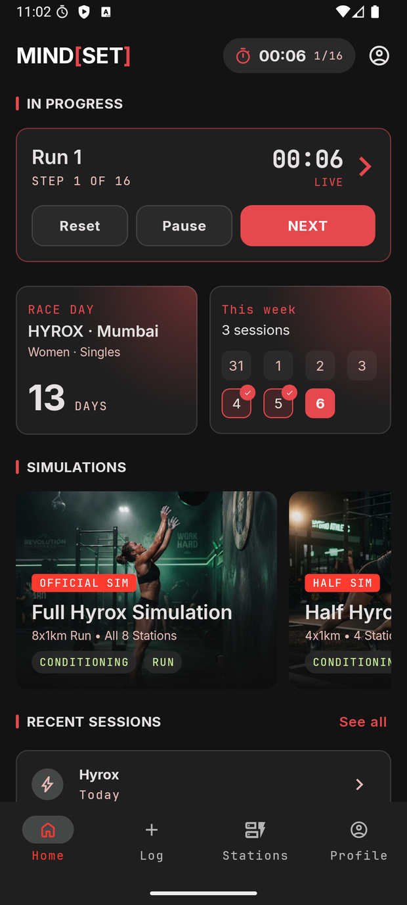</td>
<td width="25%">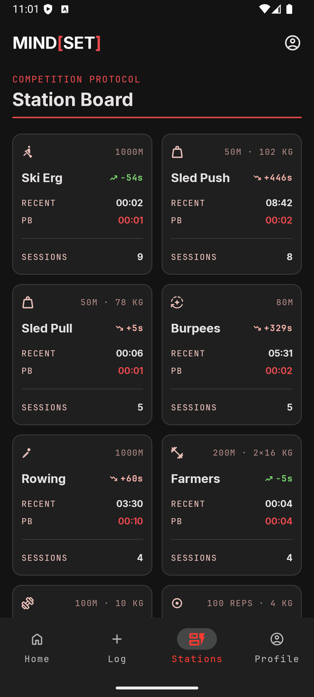</td>
<td width="25%">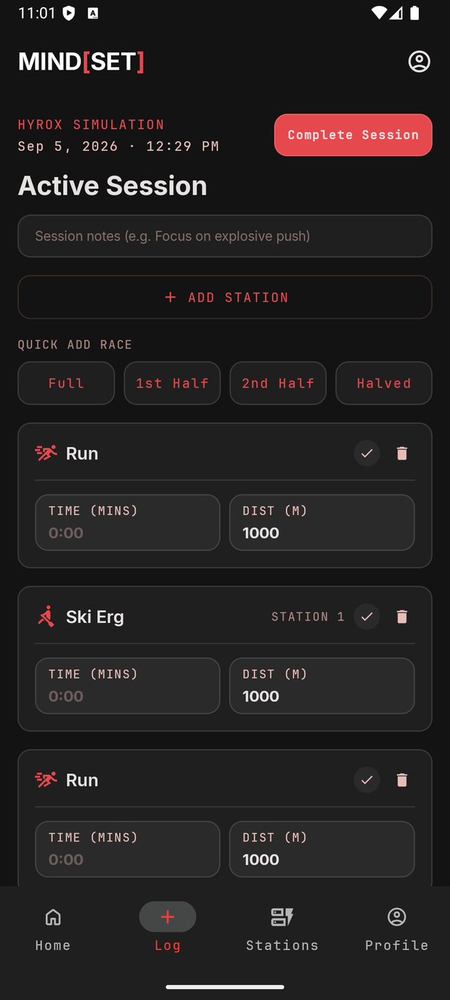</td>
<td width="25%">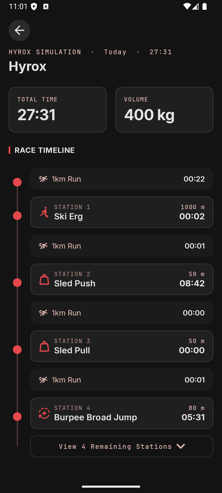</td>
</tr>
<tr>
<td><b>Home — race live</b><br><sub>Clock pinned to the app bar, race-day countdown, week strip, simulation library.</sub></td>
<td><b>Station Board</b><br><sub>Per station: division standard, last attempt vs PB, and the delta between them.</sub></td>
<td><b>Log</b><br><sub>Quick-add a Full / 1st Half / 2nd Half / Halved race, then fill in numbers.</sub></td>
<td><b>Session detail</b><br><sub>Run → station → run, every split kept, total time and volume up top.</sub></td>
</tr>
</table>

<sub><b>More:</b> <a href="docs/screenshots/android-template-hyrox.png">Hyrox simulation template</a> (division chips re-price every segment live) · <a href="docs/screenshots/android-home.png">Home, idle</a> · <a href="docs/screenshots/android-splash.png">Splash</a></sub>

### Campaign assets

Generated from the app's own fonts and palette by
[`tools/marketing/generate_campaign_assets.py`](tools/marketing/generate_campaign_assets.py) — no
design tool in the loop, so the store copy cannot drift from the theme tokens.

| | |
|---|---|
| [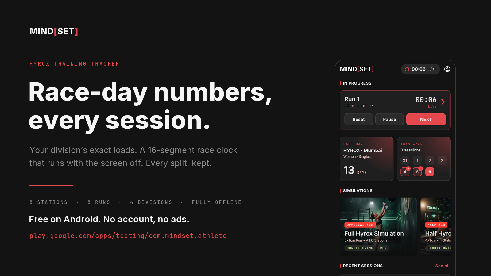](docs/marketing/01-lead.png) | [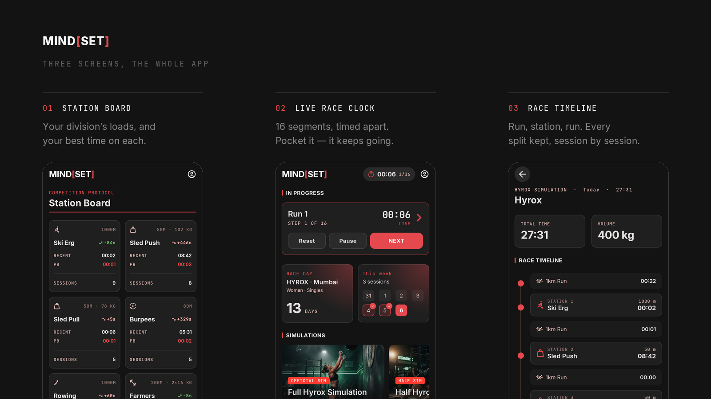](docs/marketing/02-three-up.png) |
| [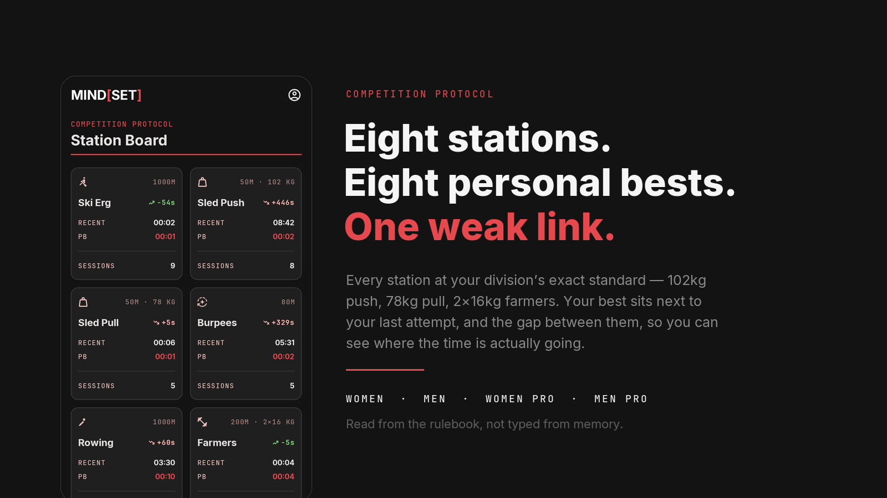](docs/marketing/03-standards.png) | [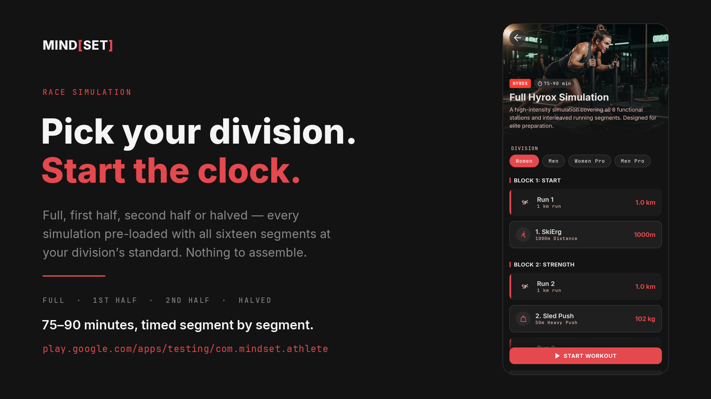](docs/marketing/04-simulation.png) |

<sub>Listing copy: [`docs/play-listing.md`](docs/play-listing.md) · tester recruitment: [`docs/marketing/tester-recruitment.md`](docs/marketing/tester-recruitment.md)</sub>

### Demo clip

**Not yet recorded at README quality.** The behaviour most worth showing is the one a screenshot
cannot carry: leave the app mid-race and the clock keeps running, driven from its notification.
The existing capture of that is a phone camera pointed at an emulator on a laptop — the notification
text is illegible below ~500 px wide and the emulator window drifts in frame, so no crop rescues it.

The conversion pipeline is committed and tested, so a clean capture becomes a GIF in one step:

```bash
adb shell screenrecord --size 720x1600 --bit-rate 8M /sdcard/demo.mp4
```

```bash
adb pull /sdcard/demo.mp4 /tmp/demo.mp4 && python3 tools/marketing/screencap_to_gif.py /tmp/demo.mp4 docs/demo/race-clock.gif --start 2 --end 14 --fps 8 --width 320
```

[`screencap_to_gif.py`](tools/marketing/screencap_to_gif.py) samples via ffmpeg when present and
otherwise via a bundled Swift/AVFoundation extractor, so it needs nothing installed on macOS beyond
Pillow. A GIF rather than the `.mp4` because GitHub will not autoplay an in-repo video in a README.

---

## Tech stack

Versions are declared once in [`gradle/libs.versions.toml`](gradle/libs.versions.toml) and read from
there — never duplicated in a build script.

| Layer | Choice | Version | Why this one |
|---|---|---|---|
| Language | Kotlin Multiplatform, K2 | `2.4.10` | One domain/data/presentation layer for both platforms |
| Build | AGP 9 + Gradle version catalogs + typesafe project accessors | `9.4.0` | AGP 9's KMP-library DSL; `projects.core.data` instead of stringly-typed paths |
| Build logic | `build-logic` included build, one convention plugin | — | KMP library baseline applied once, not copy-pasted into 20 scripts |
| Persistence | **Room-KMP** (`androidx.room3`) + `BundledSQLiteDriver` | `3.0.2` / `2.7.0` | First-party migrations, `Flow`-returning queries, Paging in `commonMain`, runs on Kotlin/Native |
| Device settings | AndroidX DataStore (`preferences-core`) | `1.2.1` | Device-local prefs that must *not* sync |
| Networking | Ktor client (OkHttp / Darwin) + kotlinx.serialization | `3.5.2` / `1.11.0` | Same client code both platforms; DTOs shared with the server |
| Backend | Ktor server, `:server` | `3.5.2` | Owns the sync protocol end-to-end; shares `:contracts` with the client |
| DI | Koin (+ Koin compiler, Kotzilla profiler opt-in) | `4.2.2` | KMP-native; kept swappable via constructor injection everywhere |
| Async | Coroutines / Flow | `1.11.0` | `StateFlow` is the UI contract on both platforms |
| Android UI | Jetpack Compose (Compose Multiplatform artifacts) + Material 3 | `1.12.0` / `1.11.0-alpha07` | Native feel, own design system on top |
| Navigation | JetBrains multiplatform `navigation-compose`, **type-safe routes** | `2.9.2` | `@Serializable` destinations — a renamed arg is a compile error, not a runtime crash |
| Paging | Paging 3 multiplatform | `3.5.1` | 870-row exercise library paged out of Room |
| Images | Coil 3 (+ OkHttp fetcher, SVG decoder) | `3.6.2` | Lazy muscle diagrams with a disk cache |
| iOS UI | SwiftUI over the shared framework | — | No CocoaPods; a `Compile Kotlin Framework` Xcode phase |
| Performance | Macrobenchmark + Baseline Profile + `profileinstaller` | `1.5.0-rc02` / `1.4.1` | Startup and frame timing **measured**, not asserted |
| Crash reporting | Firebase Crashlytics, gated on `google-services.json` | `34.18.0` | Optional: a fresh clone builds without Firebase config |
| Quality | Spotless + ktlint | `8.10.2` | One format, enforced on `*.kt`, `*.gradle.kts` and Markdown |

---

## Architecture

**Offline-first, database-as-source-of-truth, MVI.** Three rules hold the whole thing together, and
they are non-negotiable in review:

1. **The UI never reads the network.** It observes Room via `Flow`. The network only feeds the DB
   (pull) and drains the outbox (push).
2. **A local write and its intent-to-sync commit in ONE transaction.** No lost updates if the
   process dies mid-write.
3. **`commonMain` is domain + data + sync + ViewModels.** `androidMain`/`iosMain` exist *only* for
   OS-governed capabilities — DB driver, HTTP engine, secure/device storage, notifications,
   background execution. Every new seam has to be justified.

### Module graph

25 Gradle modules: an Android host, a KMP aggregator, `:core:*` for shared capability and `:feature:*`
for one vertical slice each.

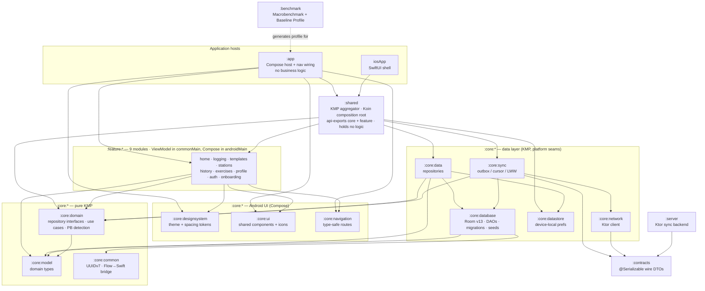

### The dependency rule

Dependencies point **inward**, toward types that cannot change for platform reasons:

```
:app / iosApp  →  :feature:*  →  :core:domain  →  :core:model
                       ↓              ↑
                 :core:ui/ds     :core:data  →  :core:database / :core:network / :core:datastore
```

- `:feature:*` depends on **`:core:domain` interfaces**, never on `:core:data` implementations or
  Room types. Wiring happens in Koin, in `:shared`.
- `:core:model` is pure Kotlin domain types. Room entities live in `:core:database` and are mapped
  at a **single seam** (`EntityToDomainMappers.kt` / `DomainToEntityMapper.kt`), so the UI and domain
  never see a Room annotation.
- `:shared` is the only module that knows every other module exists. It is the composition root and
  nothing else — `initKoin()` aggregates the `:core:*` graphs, the platform seams, and each feature's
  own `xModule`. The observability module is applied **after** the rest, because the Kotzilla
  profiler inspects the assembled graph; that ordering is load-bearing.
- `:app` is an entry point: Compose host, nav graph, notification plumbing. **826 lines**, no
  business logic.

### Unidirectional data flow

MVI: the ViewModel owns an immutable state object, exposes it as `StateFlow`, and accepts intents.
Both platforms observe the identical class.

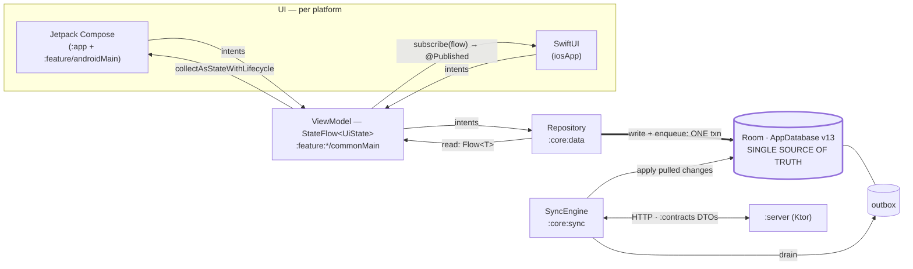

Read the arrows: **nothing** goes from `SyncEngine` to a ViewModel. A pulled change becomes visible
because it was written to Room and Room's `Flow` re-emitted — the same path a local write takes.
That is what makes "offline" the normal case rather than a degraded mode.

### The race clock: a timer that outlives its screen

The one place where "just put it in a ViewModel" is wrong, and the reasoning is worth stating:

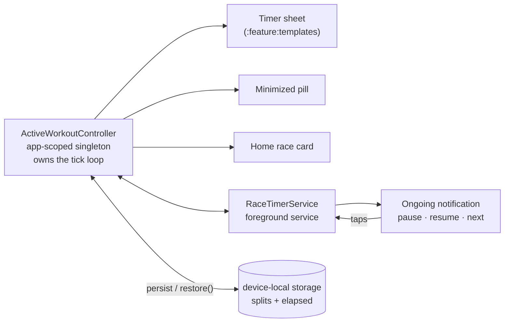

- The controller is **app-scoped, not a screen ViewModel**: it outlives navigation, so every surface
  observes the *same* `StateFlow` and they cannot drift apart.
- `RaceTimerService` holds **no state of its own** — it observes the controller and forwards
  notification taps back into it. `startForeground` is called *first*, before reading any state,
  because missing it within ~5 s of `startForegroundService` is an ANR-class crash; a null race posts
  a placeholder rather than skipping the call. (`minSdk 26` is set by this service.)
- `restore()` is idempotent, fire-and-forget, and republishes a restored race **paused at its last
  observed elapsed**. Wall time that passed while nothing was watching the clock is deliberately not
  counted — a restored total can never silently exceed the race that was actually run.

---

## Data model

Room schema **v13**, `exportSchema = true`, real versioned migrations from v7 onward (`7→8`, `8→9`,
`9→10`, `10→11`, `11→12`, `12→13`) — the destructive fallback was removed and the v7→v8 fold is
fixture-tested against the exported schema.

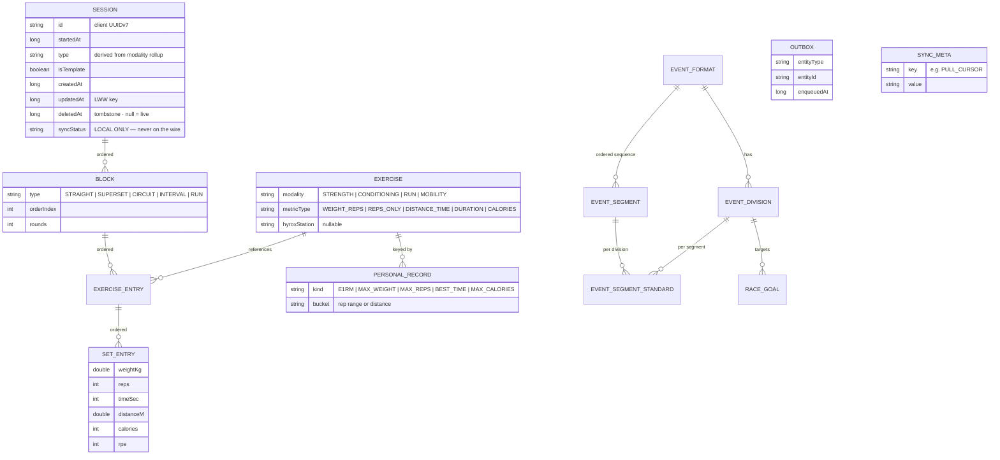

**The 4-level session model is the load-bearing decision.** A flat session cannot express a superset
or an interval block without a boolean-flag pile; `Session → Block → ExerciseEntry → SetEntry` can,
and legacy flat sessions fold into a single implicit `STRAIGHT` block, which is exactly what
`MIGRATION_7_8` does.

Every syncable entity carries `id` (client-generated **UUIDv7** — time-ordered, so inserts stay
b-tree friendly and rows sort by creation without a second column), `createdAt`, `updatedAt` (the LWW
key), and `deletedAt` (a tombstone, not a boolean, so "when" survives). `syncStatus` is a **local-only
column and never crosses the wire** — it describes this device's relationship to the server, not the
entity.

### Race formats are data, not code

`event_format` · `event_segment` · `event_division` · `event_segment_standard`, all keyed by
`formatKey`. A race format is its ordered sequence of runs, stations and transitions, its divisions,
and the exact loads/distances/rep counts each division must hit.

This is why the app is positioned as a *fitness racing* tracker rather than a HYROX app: HYROX is the
format seeded today (full 16-segment sequence, Women's/Men's × Open/Pro), and a new event is seed
rows. It is also a correctness decision — **station standards are seeded from the rulebook and
verified, never hardcoded**, because published rep counts genuinely conflict between sources (the
25-vs-26 wall-ball dispute being the standing example).

---

## Offline-first & the sync engine

A hand-written engine in [`:core:sync`](core/sync/src/commonMain/kotlin/com/mindset/sync/SyncEngine.kt).
One `sync()` pass is push-then-pull.

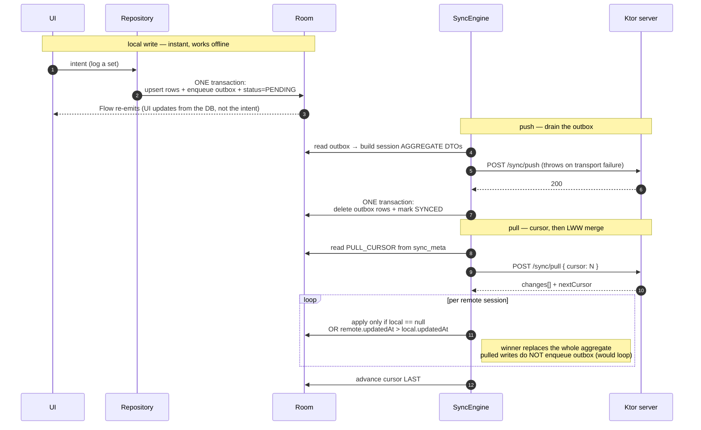

Four decisions here, with their reasons:

- **The session is the sync unit (aggregate sync).** A session plus its blocks, entries and sets
  travel as one document with every node's id and envelope preserved. A session is a bounded
  aggregate edited by effectively one device at a time, so this avoids per-set outbox rows and
  per-set conflict resolution — and it makes a **half-synced workout impossible** on another device.
- **Failure is a no-op, not a rollback.** Outbox rows and the cursor advance *only* on success, so a
  dropped connection just means the next pass retries from where it stopped. There is no partial or
  torn state to repair.
- **Last-Write-Wins by `updatedAt`, applied symmetrically** on client and server. See
  [ADR 3](#adr-3-last-write-wins-over-crdts) for what that gives up.
- **Exercises are not synced.** They are seeded on every device from a bundled catalog, so they are
  reference data, not user data.

**Honest status:** the engine is implemented, Koin-wired, and covered by 6 engine tests plus 3 server
route tests (LWW, cursor, soft delete) — but **it is dormant in the shipped v1.0**. `syncBaseUrl` is
`""` on both platforms, nothing in the app calls `sync()`, and the server store is in-memory. v1.0
ships deliberately account-free and offline-only; the multi-device path (Postgres behind the existing
`SessionStore` interface, Firebase Auth JWTs, WorkManager outbox drain) is Phase 2 in
[`docs/ROADMAP.md`](docs/ROADMAP.md). Nothing in the client changes when it lands, which is the point
of having built the seam first.

---

## The KMP seam

### Code sharing, measured

Kotlin/Swift line counts over `src/`, excluding generated and build output:

| Source set | LOC | What lives here |
|---|---:|---|
| `commonMain` — `:core:*` | **7,125** | domain, models, Room schema + DAOs + migrations + seeds, repositories, sync engine |
| `commonMain` — `:feature:*` | **2,601** | **18 ViewModels** + their immutable MVI state |
| `commonMain` — `:shared` | 51 | Koin composition root |
| `androidMain` seams | 113 | DB builder, HTTP engine, DataStore, `Platform` |
| `iosMain` seams | 241 | DB builder, HTTP engine, DataStore, `Platform`, Koin resolver, `Flow`→Swift bridge |
| **Shared logic total** | **10,131** | of which **96.5% is platform-agnostic** (10,131 → 354 LOC of seams) |
| Android UI — `:feature:*/androidMain` | 8,083 | 21 Compose screens |
| Android UI — `:core:designsystem` / `:ui` / `:navigation` | 5,407 | theme + tokens, components, icons, typed routes |
| Android host — `:app` | 826 | Compose host, nav graph, race notifications |
| iOS UI — `iosApp` | 1,199 | 22 SwiftUI files (views + stores) |
| `:contracts` | 103 | DTOs shared client ↔ server |
| `:server` | 225 | Ktor sync backend |
| `:benchmark` | 197 | Macrobenchmark + Baseline Profile generator |
| Tests | 2,802 | 102 tests across 20 files |

Read the interesting row: **100% of the domain, data, sync and presentation logic is written once**,
and the platform seams cost **354 lines** — every one of them an OS-governed capability, not a
convenience. The SwiftUI app renders its whole screen set in **1,199 lines** precisely *because* the
ViewModels, state and intents already exist in `commonMain`. Sharing logic **including ViewModels**,
while writing UI natively, is the deliberate line — see
[ADR 4](#adr-4-native-ui-per-platform--not-shared-ui).

### Observing a Kotlin `StateFlow` from Swift

Kotlin/Native exposes `suspend` functions to Swift but **not `Flow`** in an observable form. Rather
than add SKIE or KMP-NativeCoroutines, the bridge is hand-rolled so the boundary stays explicit and
dependency-free — [`FlowObserver.kt`](core/common/src/iosMain/kotlin/com/mindset/FlowObserver.kt):

```kotlin
// :core:common / iosMain — collect on Main, push each value to Swift, return a cancel handle
fun subscribe(flow: Flow<*>, onEach: (Any?) -> Unit): FlowSubscription { … }
```

```swift
// iosApp — a SwiftUI ObservableObject wraps the shared ViewModel
subscription = FlowObserverKt.subscribe(flow: viewModel.rows) { [weak self] value in
    self?.rows = (value as? [HistoryRow]) ?? []   // generics erase at the ObjC boundary → cast once
}
```

Each screen is then a ~30-line Swift `Store` (resolve the VM from Koin → subscribe → `@Published`)
plus a SwiftUI view. Two seam gotchas hit and documented in code:

1. Kotlin/Native **mangles Obj-C `new*` selectors** — hence `doInitKoin`-style naming on the
   framework entry points.
2. **Paging 3 has no Swift consumer**: `Flow<PagingData>` cannot cross the Obj-C boundary usefully,
   so the iOS exercise picker reads the bounded catalog directly instead of paging it.

---

## Performance

Cold start and scroll are **measured**, not asserted. `:benchmark` runs a Startup Macrobenchmark
(cold launch) and a Scroll Macrobenchmark (frame timing on the History list, seeded to ~200 sessions),
each under two compilation modes: `None` (no AOT — the "before") and `Partial` + the generated
**Baseline Profile** (the "after").

_Physical **Google Pixel 9 Pro**, 10 iterations per mode. `timeToInitialDisplay` (TTID) is a trace
metric, not sampled, so Macrobenchmark reports min/median/max rather than percentiles._

**Cold start** — `timeToInitialDisplay`:

| Metric | None (before) | Baseline Profile (after) | Change |
|---|---|---|---|
| TTID median | 249.3 ms | 202.4 ms | **↓ 18.8%** |
| TTID max (worst case) | 264.2 ms | 214.7 ms | ↓ 18.7% |
| TTID min (best case) | 229.6 ms | 191.2 ms | ↓ 16.7% |

The profile shifts the **entire distribution** down, not just the average — the win comes from
AOT-compiling the hot startup path so it is not JIT-compiled on the critical path of first launch.

**History scroll** — `FrameTimingMetric` over a fling:

| Metric | None (before) | Baseline Profile (after) |
|---|---|---|
| `frameOverrunMs` P90 | −8.9 ms | −9.4 ms |
| `frameOverrunMs` P99 | −6.0 ms | −6.6 ms |
| `frameDurationCpuMs` P90 | 5.7 ms | 5.6 ms |

**Reading this honestly:** `frameOverrunMs` is negative at every percentile in *both* modes — each
frame finishes ~6–11 ms **ahead** of its deadline, so the fling never janks, with or without the
profile. Steady-state scrolling JIT-warms almost immediately, so AOT barely moves it. The
Baseline-Profile win is concentrated in **cold start**; the scroll benchmark's value here is
*confirming the absence of jank* — a negative result worth stating — not demonstrating a speedup.
Profiling the startup trace likewise found no pathological main-thread work: no synchronous DB open,
no eager DI (every Koin singleton is lazy).

### The profiling-guided fix: Compose stability across the KMP seam

Profiling ruled out jank, so I turned the Compose compiler's own **stability report**
(`-PcomposeReports=true`) on the scroll path. It surfaced a latent issue:

```
// before
fun SessionRow( unstable session: Session, stable volumeKg: Double )
```

`Session` is an immutable `data class` (all `val`, primitives only) — but it lives in a KMP module
with no Compose compiler, so the compiler cannot infer stability and defaults it to **unstable**.
`SessionRow` still skipped, but only via Strong Skipping's reference (`===`) comparison; if the
backing `Flow` ever re-emitted equal-but-new instances, every visible row would recompose needlessly.

The fix is a **stability configuration file**
([`app/compose_stability.conf`](app/compose_stability.conf)) listing the immutable shared model
types — asserting their stability to the Compose compiler *without* adding a Compose dependency to
the shared modules, which would violate the KMP seam. After:

```
// after
fun SessionRow( stable session: Session, stable volumeKg: Double )
```

Honestly scoped: this is a **robustness/correctness** fix, measured via the compiler report rather
than frame time — a Pixel 9 Pro has too much headroom to jank either way. The List/Map-holding UI
states remain unstable **by design**: a read-only `List` may be backed by a `MutableList`, so
asserting stability over one would be a weaker claim than it looks. The right fix there is
`kotlinx.collections.immutable`, tracked as a follow-up.

---

## Build & release engineering

The build is treated as production code. The comments in
[`app/build.gradle.kts`](app/build.gradle.kts) are the long form; this is what they add up to.

**Version catalog as the only source of truth.** `versionName` comes from
`app-versionMajor/Minor/Patch` in `libs.versions.toml`, and `versionCode` is **derived**
(`major × 10_000 + minor × 100 + patch`) rather than maintained alongside it. Play permanently
rejects a code ≤ one already published, and a hand-kept pair drifts silently. The packing orders
codes exactly as semver orders releases, with a ceiling of `99.99.99 → 999_999` — well under Play's
`2_100_000_000` limit.

**R8 on for release**: `isMinifyEnabled` + `isShrinkResources`. Resource shrinking is only legal with
code shrinking on, because it relies on R8's reachability graph — anything looked up by name via
`Resources.getIdentifier()` is invisible to that graph. There is none today; if that changes, the
survivors go in `res/raw/keep.xml` rather than turning shrinking off. The one real keep hazard in
this codebase is **enums persisted by `name`**, not DI or serialization.

**NDK pinned** (`30.0.16138531`) even though the app ships no native code of its own: Room's bundled
SQLite driver and DataStore do, and without an NDK, AGP silently packages their `.so` files
**unstripped** — roughly 213 KB of symbol tables per ABI riding in the download. Release builds also
set `ndk { debugSymbolLevel = "SYMBOL_TABLE" }`, which extracts symbols into the AAB so Play can
symbolicate native crashes while the shipped `.so` stays stripped. `SYMBOL_TABLE` (function names)
over `FULL` (line numbers, much larger upload) is the right trade for libraries we do not maintain.

**Signing degrades gracefully.** The upload key is read from a gitignored `keystore.properties`, and
the config checks that the keystore **file** exists rather than just the property — a stale path
otherwise fails deep inside the signing task on every release-derived variant, including the
`nonMinifiedRelease` one the Baseline Profile plugin synthesizes. Absent config yields an unsigned
`assembleRelease`, which is a clearer failure than a broken build script.

**A benchmark-only seed hook, allowlisted by exact name.** Macrobenchmark needs a long History list
to scroll, so `MainActivity` honors a bulk-seed intent extra — gated on `BuildConfig.SEED_HOOK_ENABLED`,
`false` everywhere by default. `MainActivity` is **exported** and the hook writes to the user's real
database, so the variants that honor it are an exact-name allowlist
(`nonMinifiedRelease`, `benchmarkRelease`) applied via `androidComponents.onVariants` — never a
build-type or prefix match. `release` is deliberately absent, and a new variant cannot acquire the
hook by accident.

**Firebase is optional.** The `google-services` and Crashlytics plugins are applied only if
`app/google-services.json` exists, so a fresh clone builds and runs with no Firebase account.
Crash reporting is the *only* telemetry: no ads, no ad IDs, no behavioural analytics.

---

## Testing

**102 tests across 20 files.** The strategy is to put tests where the logic is — in `commonMain`,
where they run on both platforms — and to keep the expensive kinds few and targeted.

| Kind | Where | Covers |
|---|---|---|
| Pure-domain unit tests (`commonTest`) | `:core:domain`, `:core:model`, `:core:common` | PB detection (11), training stats (11), set summaries (7), session-type derivation (5), UUIDv7 monotonicity (4), capture fields (2) |
| Room integration tests (`iosTest`) | `:core:data`, `:core:database` | Session repository incl. write+outbox atomicity (17), active-workout controller (12), active-race store (6), preferences (2), PB + hydration (2), stats queries (1) |
| Migration fixture test | `:core:database` (`iosTest`) | 6 tests validating the v7→v8 fold against the **exported** schema — the migration is proven, not assumed |
| Sync engine tests | `:core:sync` (`iosTest`) | 6 tests: push clears the outbox only on success, LWW accepts newer / rejects older, cursor advance, tombstones |
| Server route tests | `:server` (JVM) | 3 tests: LWW on push, cursor pull, soft delete |
| Catalog import | `:core:database` (`commonTest`) | 4 tests on the ~870-row seed importer |
| Compose UI test | `:app` (`androidTest`) | `CaptureFlowTest` — the end-to-end logging capture flow on device |

Two notes on *why* it is shaped this way. Room integration tests live in **`iosTest`** because the
no-arg in-memory database builder is `Context`-free on Kotlin/Native — the same test exercises the
same DAOs without an emulator or Robolectric. And migrations are tested against the **exported JSON
schema** rather than the current entity classes, so a migration that forgets a column fails the test
instead of passing by construction.

---

## Architecture decision records

Short and honest: the decision, why, the tradeoff, and what I would revisit at scale.

### ADR 1: Room-KMP (Room 3) over SQLDelight
Room 3 runs on Kotlin Multiplatform, so one entity/DAO layer serves both platforms. Chosen over
SQLDelight for the first-party migration path, the `Flow`-returning query API that fits an
observe-the-DB architecture, and Paging support in `commonMain`.
**Tradeoff:** SQLDelight's compile-time-checked SQL and lighter iOS story are genuinely attractive,
and Room's KMP support is newer. **At scale:** revisit if complex analytical SQL or non-Apple/Android
targets appear.
*Gotcha paid for:* Room 3 KMP rejects `List<String>` columns with a `TypeConverter` (`MissingType`) —
list columns are stored as JSON `String` with computed accessors.

### ADR 2: Custom Ktor backend over Supabase/Firestore
The sync backend is a minimal Ktor server sharing `:contracts` DTOs with the client. Chosen to own
the sync protocol end-to-end — it is the part of this project I most want to be able to defend — and
for the full-stack-Kotlin signal. **Rejected:** Supabase (free tier pauses after 7 days idle, and
replacing the engine is portfolio-negative) and Firestore (its offline cache is a cache, not a source
of truth, which contradicts rule 1).
**Tradeoff:** real ops, and no free auth/storage. **At scale:** managed Postgres behind the existing
`SessionStore` interface plus a real auth provider behind the same DTO contract — the client does not
change.

### ADR 3: Last-Write-Wins over CRDTs
Conflicts resolve LWW by `updatedAt`, symmetric on client and server. A training log is single-user
and low-contention, so this is the simplest rule that is *correct for the domain*.
**Tradeoff:** LWW can drop a concurrent edit. **At scale / multi-editor:** per-field merge or a CRDT
for shared plans, kept behind the existing outbox/cursor seam so the swap is local.

### ADR 4: Native UI per platform — not shared UI
Share everything *except* the UI: `commonMain` holds domain, data, sync and **ViewModels**; each
platform writes its own Compose/SwiftUI. **Why:** platform-native feel, and the ViewModels already
hold all state and logic, so the UI layer stays thin.
**Tradeoff:** two UI layers instead of one Compose Multiplatform layer. **At scale:** CMP is viable —
but I wanted to *measure* how far shared-logic/native-UI actually goes, and the
[code-sharing numbers](#code-sharing-measured) are the answer.

### ADR 5: Hand-rolled `Flow`→Swift bridge over SKIE
A ~20-line `subscribe(flow, onEach)` helper instead of the SKIE compiler plugin. **Why:** zero new
dependencies, and the KMP boundary stays legible — I can explain exactly how collection, main-thread
dispatch and cancellation cross into Swift.
**Tradeoff:** SKIE gives idiomatic `AsyncSequence` and sealed classes for free. **At scale:** adopt
SKIE, because the per-screen glue is what grows.

### ADR 6: Koin over Hilt/Metro
Koin is KMP-native; Hilt is Android-only. Kept swappable via **constructor injection everywhere**, so
the DI framework is a thin composition-root detail rather than something woven through the code —
the Metro/kotlin-inject migration would touch `:shared` and nothing else.

### ADR 7: Firebase Auth (buy) over a self-built JWT + refresh stack
For the Phase 2 multi-device path: Google (Android) + Apple (iOS) → Firebase ID token as a Bearer
JWT → Ktor validates it **statelessly** via Google's JWKS, with `sub` as the user id. **Why:** token
rotation, revocation and provider quirks are a solved problem I would rather not re-solve; the time
saved goes into the race module, which is the actual differentiator.
**Tradeoff:** a hard dependency on Google's identity infrastructure.

### ADR 8: Race formats as reference data, never hardcoded
Segments, divisions and per-division standards are database rows keyed by `formatKey`. **Why:** a new
event becomes seed data instead of a code change — and station standards genuinely conflict between
published sources, so they must be seeded from the rulebook and verifiable against it rather than
typed from memory.
**Tradeoff:** more schema and a seed path to maintain than four hardcoded constants.

---

## Build & run

Task names use the `androidLibrary` plugin's **`hostTest`** terminology (not the classic
`testDebugUnitTest`). [`AGENTS.md`](AGENTS.md) is the authoritative command list.

**Android**

```bash
./gradlew :app:assembleDebug
```

**Shared tests — pure domain (`commonTest`, on the JVM host)**

```bash
./gradlew :core:domain:testAndroidHostTest :core:model:testAndroidHostTest :core:common:testAndroidHostTest
```

**Shared tests — Room integration, migrations and sync engine (`iosTest`, on the simulator)**

```bash
./gradlew :core:data:iosSimulatorArm64Test :core:database:iosSimulatorArm64Test :core:sync:iosSimulatorArm64Test
```

**Sync backend**

```bash
./gradlew :server:run
```

```bash
./gradlew :server:test
```

**Formatting (Spotless + ktlint, over Kotlin, Gradle scripts and Markdown)**

```bash
./gradlew spotlessApply
```

**Performance — needs a physical device with USB debugging**

```bash
./gradlew :app:generateBaselineProfile
```

```bash
./gradlew :benchmark:connectedBenchmarkReleaseAndroidTest -Pandroid.testInstrumentationRunnerArguments.class=com.mindset.benchmark.StartupBenchmark
```

```bash
./gradlew :benchmark:connectedBenchmarkReleaseAndroidTest -Pandroid.testInstrumentationRunnerArguments.class=com.mindset.benchmark.ScrollBenchmark
```

Results print per metric (min/median/max for startup, P50–P99 for frame timing) and land under
`benchmark/build/outputs/`.

**Diagnostics**

```bash
./gradlew :app:assembleRelease -PcomposeReports=true   # Compose compiler stability + metrics reports
```

```bash
./gradlew :app:assembleDebug -Pmindset.profiler=true   # attach the Kotzilla Koin graph profiler (debug only)
```

**iOS** — open `iosApp/iosApp.xcodeproj` in Xcode and run. The shared framework is built by a
`Compile Kotlin Framework` build phase; there is no CocoaPods or SPM step.

**Release** — signing reads a gitignored `keystore.properties` at the repo root; copy
[`keystore.properties.template`](keystore.properties.template) and fill it in. Firebase Crashlytics
activates only if `app/google-services.json` is present.

---

## Repository layout

```
MindSet/
├── app/                        Android entry point — Compose host, nav graph, race notifications (826 LOC)
├── shared/                     KMP aggregator + Koin composition root; api-exports core + feature
├── core/
│   ├── model/                  pure domain types (Session, Block, SetEntry, EventFormat, …)
│   ├── common/                 UUIDv7 · Platform expect/actual · iOS Flow→Swift bridge
│   ├── domain/                 repository interfaces, use cases, PB detection, stats
│   ├── database/               Room v13 — entities, 17 DAOs, migrations, exported schemas, seeds
│   ├── datastore/              device-local preferences (DataStore)
│   ├── network/                Ktor client, SyncApi, per-platform engines
│   ├── data/                   repository implementations, mappers, ActiveWorkoutController
│   ├── sync/                   the sync engine (outbox push · cursor pull · LWW)
│   ├── designsystem/           "Obsidian Performance" dark theme, typography, spacing + shape tokens
│   ├── ui/                     shared Compose components, icon composables, drawables
│   └── navigation/             type-safe @Serializable routes
├── feature/                    home · logging · templates · stations · history ·
│                               exercises · profile · auth · onboarding
│                               (ViewModel + MVI state in commonMain, Compose in androidMain)
├── contracts/                  @Serializable wire DTOs — shared client ↔ server
├── server/                     Ktor sync backend (in-memory store; Postgres is Phase 2)
├── benchmark/                  Macrobenchmark (Startup, Scroll) + Baseline Profile generator
├── iosApp/                     SwiftUI shell over the shared framework (22 files)
├── build-logic/                included build — the KMP library convention plugin
├── docs/
│   ├── screenshots/            v1 Android screens (ios-* are the pre-redesign shell)
│   ├── marketing/              generated campaign images + tester-recruitment copy
│   └── *.md                    PRD · ROADMAP · data-layer-v3 · design tokens · play listing · privacy policy
├── tools/
│   ├── branding/               app-icon generator (every launcher/splash asset is generated)
│   ├── marketing/              campaign-image generator · screen-recording → GIF pipeline
│   └── intervals/              intervals.icu API probe
├── AGENTS.md                   canonical agent brief + architecture rules (start here)
└── gradle/libs.versions.toml   single source of truth for every version
```

---

## Status, roadmap & known limitations

**v1.0 shipped** (`b2c651c`) — Play-signed, R8-shrunk, Crashlytics-instrumented, offline-only by
design. 110 commits over roughly two months.

Complete: the 4-level data model behind tested migrations, template-first capture, the live race
clock with a foreground service and process-death restore, division-correct HYROX standards as seed
data, PB detection and the station board, the ~870-exercise library with muscle diagrams, the
25-module `:core:*`/`:feature:*` graph, the sync engine + `:contracts` + `:server`, Baseline Profile
and Macrobenchmark instrumentation, and the SwiftUI app rendering its screen set from shared
ViewModels.

Known limitations — the signals that matter as much as the feature list:

- **Sync is dormant in the shipped build.** The engine is written, wired and tested, but
  `syncBaseUrl` is empty, nothing calls `sync()`, and the server store is in-memory (data lost on
  restart). Multi-device is Phase 2, not a claim about today.
- **No auth.** The server is a single anonymous user. Firebase Auth is decided
  ([ADR 7](#adr-7-firebase-auth-buy-over-a-self-built-jwt--refresh-stack)) but not built.
- **iOS is a generation behind.** It compiles and runs, but at the pre-v1 screen set (Home, Stats,
  History, Session detail, Log, New session, Exercise picker/detail, Profile) and in the **old light
  theme** — the Obsidian redesign, the race clock, Stations, Templates and Onboarding are all
  Android-only. The committed
  [iOS screenshots](docs/screenshots/ios-home.png) are that legacy shell, not the app above; they
  are kept as the honest record of the parity gap. This is a deliberate call — iOS keeps compiling,
  new screens land Android-first, and parity is a batched post-race port. No iPad or size-class
  adaptation yet.
- **`app/compose_stability.conf` has stale entries.** `Session` and `SetEntry` moved to
  `com.mindset.model` in the data-model-v2 refactor, and `LoggedItem`/`HomeStats` no longer exist, so
  four of its six lines are currently inert. The stability *argument* above still holds; the file
  needs re-pointing at the new FQNs and re-verifying with `-PcomposeReports=true`.
- **List/Map UI states are not Compose-stable** — needs `kotlinx.collections.immutable`
  (deliberately not papered over with a stability assertion).
- **LWW can drop a concurrent edit** — see [ADR 3](#adr-3-last-write-wins-over-crdts).
- **No CI.** There is no `.github/workflows`; assemble + `commonTest` on PR is a Phase 1 leftover.
- **No Health Connect / HealthKit import** — the highest-value next feature, and the best remaining
  "shared vs native" seam. The gym's own app is a Spur.fit white-label with no public API, so
  Health Connect is the integration path rather than a direct one.
- **No export or account deletion** yet (both are Phase 2 requirements, not optional ones).

Direction is tracked in [`docs/ROADMAP.md`](docs/ROADMAP.md): Postgres + Firebase Auth and sync
hardening (Phase 2), the general `RaceFormat` engine with pacing and prediction plus a real beta
(Phase 3), insights and training load (Phase 4), Health Connect import (Phase 5), and the program
engine with the iOS parity batch (Phase 6).

---

## Credits

Exercise data and muscle diagrams come from open datasets and are credited in-app on the Credits
screen. Privacy policy: [`docs/privacy-policy.html`](docs/privacy-policy.html).

Built by [Tanvi Goyal](https://github.com/Tanvi-Goyal) — an athlete's daily driver first, a KMP
engineering study second.
