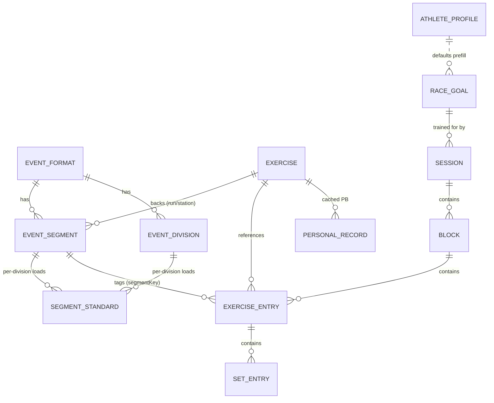

# MindSet — Data Layer v3 (HLD + LLD)

**Status:** Design approved 2026-08-04 · **Owner:** Tanvi Goyal · **Scope:** v1 (Hyrox-only, DB-first, no networking) · **DB migration:** Room v11 → v12

> North star: answer **"am I actually getting fitter for my race?"** and make logging *what the athlete actually did* the smallest possible tax. Two rules the schema must not violate: **sweaty-thumb** (capture ≤3 taps, one-handed) and **capture is free, the answer is paid** (never gate logging; gate insight).

---

## 1. Current state of the data layer (what iteration 3 inherits)

The data model is on its **2nd iteration** (Room v8–v11) and is genuinely good — iteration 3 keeps its spine and generalizes the edges. What exists today:

**The write model** is a 4-level aggregate, all flat Room tables reassembled by the repo into a hydrated `SessionDetail`:

```
Session ─< Block ─< ExerciseEntry ─< SetEntry
```

- `SetEntry` is **polymorphic**: one row carries *both* a prescription (`target*`) and a performance (actuals: `reps/loadKg/timeSec/distanceM/calories/rpe`). A template fills only targets; a logged set fills actuals; the "ghost value" logging UX is a template set whose actuals get filled in. This is the model's central, well-chosen bet.
- A **template is just a `Session` with `isTemplate = true`** — same object, same tree.
- `Exercise` is a ~870-row **reference catalog** (not synced), carrying `modality` / `defaultMetric` / `hyroxStation`. `MetricType → CaptureFields` (a total `when`, no `else`) drives which inputs a set shows.
- **Hyrox already exists as data**, not hardcode: `hyrox_stations`, `hyrox_divisions`, `hyrox_station_loads` reference tables, seeded from `HyroxSeed` and seed-versioned. The live timer synthesizes a *real* `Session` (one entry+set per step) so a completed race shows up in History like any workout.
- **Sync-readiness is already enforced** even though v1 has no networking: every user-owned entity is `Syncable` (UUIDv7 `id`, `createdAt`, `updatedAt` LWW key, `deletedAt` tombstone); `syncStatus` is local-only; **local write + outbox enqueue happen in one transaction**; the session is the sync unit (one deterministic `session:<id>` outbox row). The full push/pull/LWW `SyncEngine` is built and unit-tested against a fake API — only a live server is missing.
- Device-local singletons: `athlete_profile`, `entitlement`, `preferences`; plus `planned_session` (Home "today").

**Where it falls short for the MindSet / multi-event product:**

| Gap | Consequence |
|---|---|
| Reference data is **Hyrox-specific** (`hyrox_*` tables) | The 2nd event (DEKA/CrossFit) forces new tables + a migration — the exact churn we want to avoid. |
| The **goal race lives on the profile singleton** (`raceDate/raceFormat/raceCity`) | Only one race, ever; no past-race history; race intent tangled with identity; can't answer "fitter for *this* race" across a training block. |
| A race session's **runs and stations are inferred** from `orderIndex` + `exerciseId` | The Race Timeline, per-segment PBs, and compromised-running insight are awkward to query. |
| `PersonalRecord` has **no weight-class dimension** | "Sled Push @ Men" can't be a distinct PB from "@ Women Pro" — but the Station Board is built around weight-class PBs. |
| Volume aggregation is **strength-only** (`reps × loadKg`) | A Hyrox-first product needs time/pace/distance rollups (this is a query gap, not schema). |

---

## 2. Strategic decisions (the staff-engineer forks)

Four decisions shape the schema for years. Each was taken to **minimize future migrations** — the explicit goal.

**D1 — Generalize the reference plane *now* (Hyrox becomes seed data).**
Replace `hyrox_*` with format-agnostic `event_format · event_segment · event_division · segment_standard`. Adding DEKA later = **seed rows, zero migration**. *Rejected:* staying Hyrox-specific (cheaper now, guarantees a migration when event #2 lands). *Rejected:* a fully generic EAV measure table (kills type-safety and query performance; the fixed-column `SetEntry` is already proven).

**D2 — Unify race sims into the one `Session` tree.**
A race sim stays a `Session ─< Block ─< ExerciseEntry ─< SetEntry`, with each run/station entry **tagged** to its format segment. *Why:* one History, one sync unit, one aggregation path — and it's exactly what the live timer already synthesizes. *Rejected:* dedicated `race_result`/`race_split` tables → two "what I did" sources of truth, two write/sync paths.

**D3 — First-class, multi-instance `race_goal`.**
Split the goal race out of the profile into its own syncable entity (format, division, date, city, goal time, status). *Why:* the north-star question is *per race*; you need past + upcoming races and a link from each sim to the race it trained for. *Rejected:* keeping the single target on the profile (simplest, but one race forever).

**D4 — Physical-only v1, with a `Modality` seam for the future mindset/recovery log.**
Model only physical training capture for v1 (matches the problem statement). The Figma's breath/recovery "mindset" log slots in later as a new `Modality`/`SessionType` — **no structural change**.

---

## 3. HLD — three data planes



- **Reference plane** — seeded, **seed-versioned**, never synced, stable-slug ids: `event_format`, `event_segment`, `event_division`, `segment_standard`, `exercises`. Runs *and* stations are catalog exercises; the format is data.
- **User plane** — syncable (envelope + one-txn outbox): `race_goal`, the `Session` tree (now race-aware via `formatKey/divisionKey/raceGoalId` on `Session` and `segmentKey` on `ExerciseEntry`), and `personal_record` (+ `divisionKey`).
- **Device-local plane** — singletons, Phase-2 auth keys them to a user: `athlete_profile` (identity + physical baseline only), `entitlement`, `preferences`, `planned_session`.

**Invariants preserved:** DB is the single source of truth (UI observes Flow, never the network); canonical units (kg / m / s / epoch-millis, display converts); enum-ish columns stored as `.name` TEXT; list columns as JSON strings with computed accessors (Room 3 KMP rejects `List<T>` columns).

---

## 4. LLD — target schema (v12)

### 4.1 Reference plane (replaces `hyrox_*`)

**`event_format`** `formatKey` PK · `name` · `description`

**`event_segment`** — the full ordered sequence (Hyrox = 8 RUN + 8 STATION = 16 rows)
`id` PK slug · `formatKey`(idx) · `orderIndex` · `kind` {RUN/STATION/TRANSITION} · `exerciseId`→catalog · `name` · `label` · `metric`(MetricType) · `distanceM?` · `reps?` · `loadType?` · `descriptor`
*Change vs today:* the old `runBeforeLabel` (run folded into the station row) becomes **explicit RUN segments** → the timeline and per-run pace are an ordered read.

**`event_division`** — gender × tier
`id` PK (`HYROX:MEN`) · `formatKey`(idx) · `key` (WOMEN/MEN/WOMEN_PRO/MEN_PRO, stored on sessions/goals/PRs) · `label` · `gender` {WOMEN/MEN} · `tier` {OPEN/PRO} · `orderIndex`

**`segment_standard`** — per-division parameters (absorbs `hyrox_station_loads` *and* the wall-ball kg/target that were on the old division row)
`id` PK · `formatKey`(idx) · `divisionKey`(idx) · `segmentId`(idx) · `mode` {SINGLES default; DOUBLES/RELAY seedable later} · `loadKg?` · `loadDisplay?` · `targetReps?` · `targetDistanceM?` · `targetHeightM?`

Seed: `EventSeed.kt` (replaces `HyroxSeed`), gated by `event_seed_version` in `sync_meta`. v1 seeds Hyrox only, SINGLES standards only.

### 4.2 User plane

**`race_goal`** (new, syncable)
`id` PK UUIDv7 · `formatKey` · `divisionKey` · `mode` (RaceMode) · `targetDate?` · `city?` · `goalTimeSec?` · `status` (UPCOMING/COMPLETED/ABANDONED) · `createdAt` · `updatedAt` · `deletedAt?` · `syncStatus` (local) · index `(status, targetDate)`
DAO: `observeUpcoming()` = `WHERE status='UPCOMING' AND deletedAt IS NULL ORDER BY targetDate LIMIT 1`.

**`sessions`** — additive nullable columns (plain `ADD COLUMN`)
`+ raceGoalId?` (provenance) · `+ formatKey?` · `+ divisionKey?` (self-describing even if goal deleted) · `+ avgHeartRate?` · `+ caloriesKcal?` · `+ perceivedEffort?` (session RPE — the only intensity source until Health Connect).
*Not stored (insight = paid):* total time, distance, "SCORE", "NEW PB" — derived in domain.

**`exercise_entries`** — `+ segmentKey?` → `event_segment.id`. Tags a race entry to its segment (null for non-race work). Enables the ordered timeline, per-segment PB grouping, compromised-running per-run splits.

**`personal_records`** — `+ divisionKey?`; index → `(exerciseId, kind, divisionKey, distanceBucketM)`. Weight-class PBs; `distanceBucketM` stays for time-per-distance PBs (1km run, SkiErg split).

### 4.3 Device-local

**`athlete_profile`** — slim to identity + baseline: `id`(=0) · `fullName` · `bodyweightKg?` · `heightCm?` · `defaultDivisionKey` (renamed) · `defaultMode?` · `onboardingComplete`. **Removed** `raceDate/raceFormat/raceCity` → migrated into a `race_goal`.

### 4.4 New enums (`:core:model`)
`SegmentKind{RUN,STATION,TRANSITION}` · `RaceMode{SINGLES,DOUBLES,RELAY}` · `RaceGoalStatus{UPCOMING,COMPLETED,ABANDONED}` · `Gender{WOMEN,MEN}` · `Tier{OPEN,PRO}` · `EventFormat.HYROX`. Reuse `SessionSource.RACE_SIM`, `Modality` (the mindset-log seam), `MetricType`, `CaptureFields`.

---

## 5. Migration v11 → v12 (🎓 learning-critical, fixture-tested)

Convention: nullable adds = `ALTER TABLE ADD COLUMN`; NOT-NULL adds / column removals = **table-recreate** copying Room's exact generated `createSql` (SQLite can't `ADD COLUMN NOT NULL` without a default Room's schema doesn't declare).

1. **Create** `event_format/segment/division/segment_standard` (+ indices). Empty — runtime `ensureSeeded()` (bump `event_seed_version`) populates.
2. **Drop** `hyrox_stations/divisions/station_loads` (pure reference data, regenerated — no user data lost); remove `hyrox_seed_version`.
3. `sessions`: add the 6 nullable columns (§4.2).
4. `exercise_entries`: add `segmentKey` (nullable).
5. `personal_records`: add `divisionKey` (nullable); drop old composite index, create the new one.
6. **Create** `race_goal`; **data-preserving move** of an existing user's race intent:
   ```sql
   INSERT INTO race_goal (id, formatKey, divisionKey, mode, targetDate, city, goalTimeSec,
                          status, createdAt, updatedAt, deletedAt, syncStatus)
   SELECT 'goal-migrated-0', 'HYROX', defaultDivision, COALESCE(raceFormat,'SINGLES'),
          raceDate, raceCity, NULL, 'UPCOMING',
          strftime('%s','now')*1000, strftime('%s','now')*1000, NULL, 'PENDING'
   FROM athlete_profile WHERE id = 0 AND raceDate IS NOT NULL;
   ```
7. **Recreate `athlete_profile`** slim (copy `defaultDivision`→`defaultDivisionKey`, `NULL`→`defaultMode`, drop race columns).
8. Bump `AppDatabase` version → **12**; export `schemas/12.json`; add v11→v12 to `MigrationTest`.

---

## 6. Edge cases explicitly handled

1. **Returning onboarded user** — race intent migrates into a `race_goal`; Home countdown survives the upgrade.
2. **Multiple / past races** — `race_goal.status` + `targetDate`; Home = next UPCOMING, Profile shows past races; sims link via `raceGoalId`.
3. **Partial / DNF capture** — sparse entries + `finishedAt IS NULL`; discard = `deletedAt`. No special state.
4. **Rep- vs distance/time-scored stations** — per-segment `metric` + `Exercise.defaultMetric` → `CaptureFields`.
5. **Weight-class PBs** — `personal_record.divisionKey`.
6. **Compromised running** — explicit RUN segments with per-run `timeSec`/`distanceM`; fade computed in domain.
7. **Rulebook drift** (25 vs 26 wall-ball reps) — seed-versioned reference; bump to re-seed, no migration.
8. **New event (DEKA/CrossFit)** — new `event_format` + seed rows only; zero migration.
9. **Doubles / Relay** — `race_goal.mode` + `segment_standard.mode` reserved; v1 seeds SINGLES.
10. **Non-race session** — all race columns null; the generic tree is unchanged.
11. **Template provenance** — existing `templateId` retained, orthogonal to `raceGoalId`.
12. **Sync-readiness** — `race_goal` carries the full envelope + outbox now; Phase-2 sync adopts it with no schema break.

## 7. Deliberately deferred (clean seams, no v1 build)
Mindset/recovery log (`Modality` seam) · bodyweight time-series (`body_metric_log`, Phase 4) · HR/calories population (Health Connect, Phase 5) · materialized weekly rollups (Phase 4) · wiring `race_goal`/`event_*` into the live `SyncEngine` (Phase 2).

## 8. Verification
- `:shared:testAndroidHostTest` — `EventSeed` = 16 segments + 4 divisions + SINGLES standards; `startRaceSession` tags every entry with `segmentKey`; PR detection buckets by `divisionKey`; onboarding writes profile **and** goal.
- `:shared:iosSimulatorArm64Test` — `MigrationTest` v11→v12 fixture: `race_goal` created from a v11 profile carrying `raceDate`; `event_*` present, `hyrox_*` gone; no data loss.
- `:app:assembleDebug`; manual upgrade shows migrated countdown; full sim renders an 8-run/8-station ordered timeline.
- **Generalization proof:** a throwaway `DEKA` seed reads with **no migration**.
